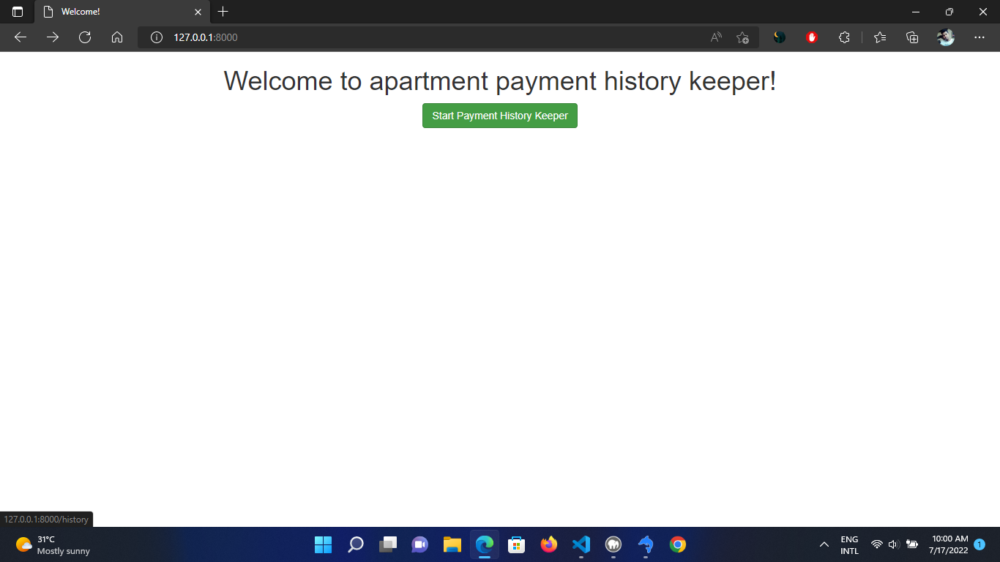
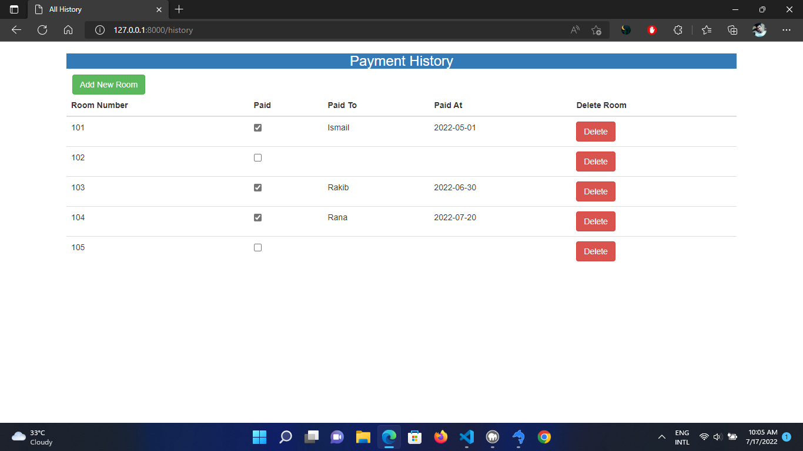
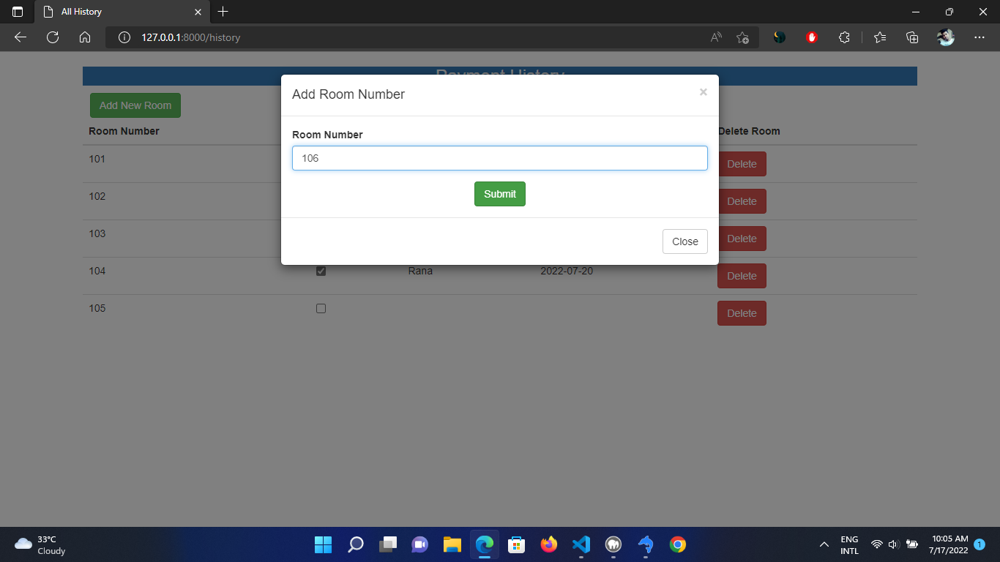
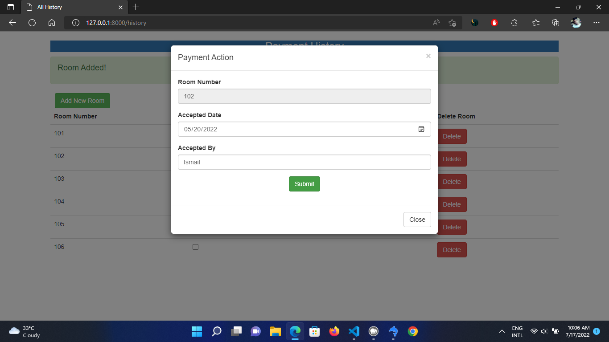
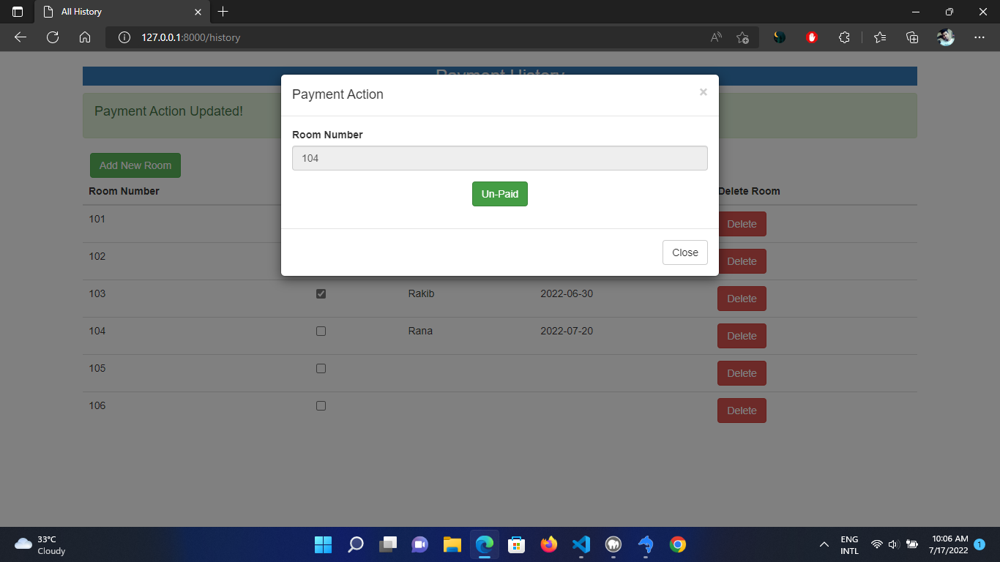

<h1>Laravel 9 Bootstrap Crud</h1>

This is a simple Payment History Manager using laravel 9 and bootstrap.

1) download zip file or clone the project
2) rename .env.example to .env
3) open .env and update DB_DATABASE (database details)
4) run command : composer install
5) run command : php artisan key:generate
6) run command : php artisan serve

